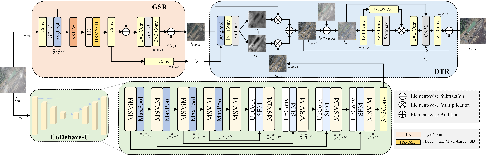
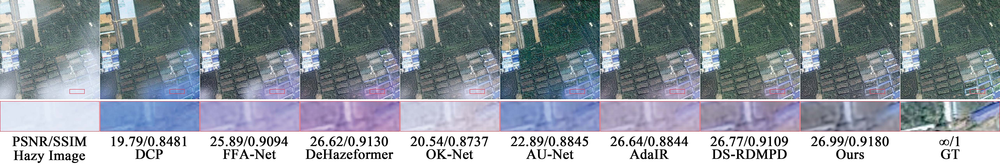
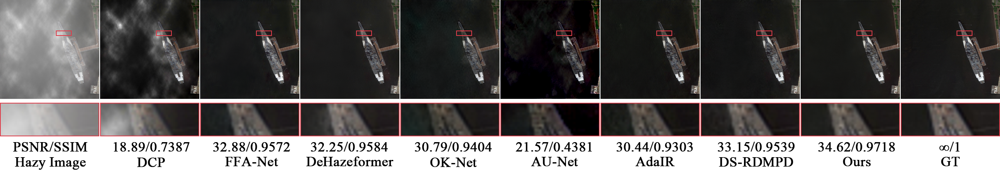

# CoDehazeNet: An End‑to‑End Collaborative Network for Global-to-Local Remote Sensing Image Dehazing

**News: Congratulations on our work being accepted by IEEE ICME2026! The code is being revamped at an accelerated pace.**

This is the official PyTorch implementation of the paper:

CoDehazeNet is an end-to-end network inspired by the human visual perception mechanism of "coarse to fine." It strategically decouples the dehazing process into two stages: dual global guidance and residual domain local refinement, to balance overall consistency and local detail. The model collaboratively captures atmospheric features and generates confidence maps through a Global Structure Restorer (GSR) and a CoDehaze-U backbone network, which then guides the Detail Texture Refiner (DTR) to adaptively recover high-frequency texture details using conditional space residual compensation techniques.

---

## 🧠 Network Architecture



---

## 📊 Visualize the results



---

### 🚀 Getting Started

We train and test the code on **PyTorch 1.13.0 + CUDA 11.8**. The detailed configuration is mentioned in the paper.

#### Create a new conda environment
```bash
conda create -n CoDehazeNet python=3.8 
conda activate CoDehazeNet
